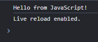
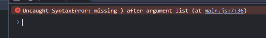
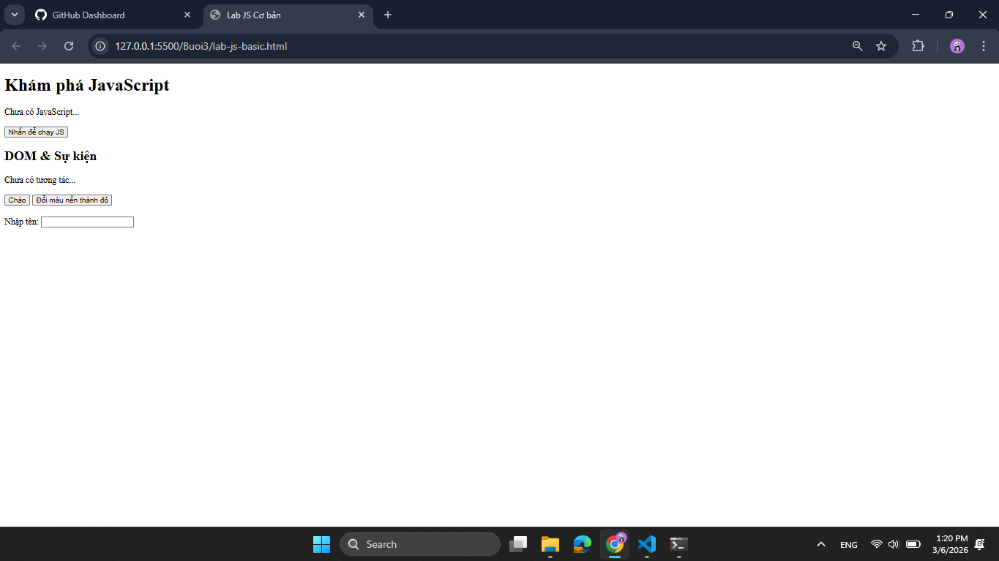
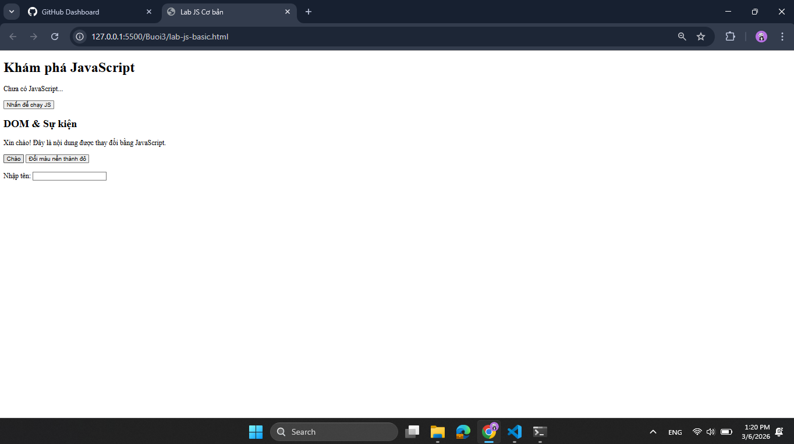
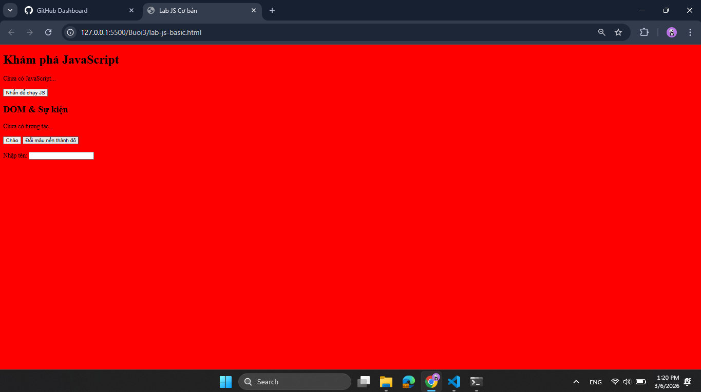
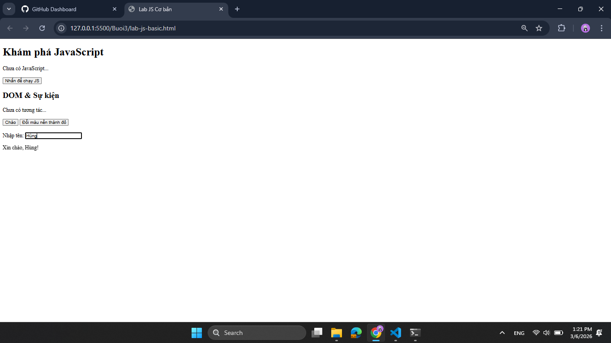

## BTTH03: JS nền tảng, DOM & Sự kiện

**Đối tượng:** Sinh viên chưa học lý thuyết JavaScript

---

## 1. MỤC TIÊU HỌC TẬP

Sau buổi lab, sinh viên có thể:

- Mô tả được JavaScript là gì, chạy ở đâu, khác HTML/CSS ở điểm nào.
- Viết được các đoạn JS đơn giản với:
  - Biến, kiểu dữ liệu cơ bản (number, string, boolean),
  - Cú pháp lệnh, toán tử đơn giản,
  - Cấu trúc điều khiển if/else, vòng lặp đơn giản,
  - Hàm (function) có tham số và giá trị trả về.
- Thao tác được với DOM:
  - Lấy phần tử bằng `document.getElementById`,
  - Thay đổi nội dung văn bản, kiểu dáng (style),
  - Lắng nghe và xử lý một số sự kiện cơ bản: `click`, `input`.
- Nhận biết jQuery là một thư viện hỗ trợ thao tác DOM/sự kiện (ở mức nhận diện, chưa cần sử dụng thành thạo).

---

## 2. CẤU TRÚC THỜI GIAN BUỔI LAB
- 03 tiết thực hành.

---

## 3. HOẠT ĐỘNG 1 (45’): GIỚI THIỆU JS & CÚ PHÁP CƠ BẢN

### 3.1. Chuẩn bị file HTML & JS

Tạo file `lab-js-basic.html`:

```html
<!DOCTYPE html>
<html lang="vi">
<head>
  <meta charset="UTF-8">
  <title>Lab JS Cơ bản</title>
</head>
<body>
  <h1>Khám phá JavaScript</h1>
  <p id="welcome">Chưa có JavaScript...</p>
  <button id="runBtn">Nhấn để chạy JS</button>

  <script src="main.js"></script>
</body>
</html>
```

Tạo file `main.js`:

```js
console.log("Hello from JavaScript!");
```


---

### 3.2. Nhiệm vụ cho sinh viên

#### Bước 1: Mở file \& Quan sát bằng Console

1. Mở `lab-js-basic.html` trong trình duyệt (Chrome/Edge/…).
2. Mở DevTools → tab **Console**.
3. Quan sát thông báo xuất hiện.

> Câu hỏi:
> - Em thấy dòng thông báo nào trong console?

> - Điều này cho em biết JavaScript đang làm gì khi trang web được tải?

---

#### Bước 2:  “JavaScript là gì?” (Tra cứu nhanh)

Sử dụng 1–2 nguồn tài liệu (vd. W3Schools, freeCodeCamp, …), tóm tắt:

> a) JavaScript chạy ở đâu? (Trình duyệt / Server / Cả hai?)
> b) HTML, CSS, JavaScript mỗi phần chịu trách nhiệm chính về điều gì?
>
> - HTML: Xây dựng bộ khung và nội dung cho trang web
> - CSS: Định dạng bố cục, màu sắc và và giao diện 
> - JavaScript: Xử lí logic và tương tác

---

#### Bước 3: Thử nghiệm biến \& kiểu dữ liệu trong Console

Trong tab Console, gõ từng dòng sau và ghi lại kết quả:

```js
let age = 20;
const name = "An";
let isStudent = true;

typeof age;
typeof name;
typeof isStudent;

1 + 2 * 3;
"Hello " + "world";
```

> Câu hỏi:
> - Kết quả `typeof age` là number
> - Kết quả `typeof name` là string
> - Kết quả `typeof isStudent` là boolean
> - Em hãy tự mô tả ngắn gọn:
>   - `number` là: số
>   - `string` là: chuỗi kí
>   - `boolean` là: đúng hoặc sai

---

#### Bước 4: Viết đoạn script tính tuổi

Mở file `main.js`, viết thêm:

```js
let name = "An";
let yearOfBirth = 2005;
let currentYear = 2026;
let age = currentYear - yearOfBirth;

console.log("Xin chào, mình là " + name + ", năm nay mình " + age + " tuổi.");
```

Sau đó:

1. Đổi giá trị `name`, `yearOfBirth` thành thông tin của chính em.
2. Reload trang \& quan sát console.

> Câu hỏi:
> - Dòng log hiển thị gì sau khi em sửa thông tin?
> - Nếu em quên dấu `;` hoặc quên dấu `+`, điều gì xảy ra? Trình duyệt báo lỗi thế nào?
Nếu quên dấu `;`thì console thì trình duyệt vẫn bình thường còn nếu quên `+`thi trang báo lỗi cú pháp


---

#### Bước 5: Phản tư nhanh (Reflection)

> - Điều thú vị nhất em vừa khám phá được về console là gì?
> - Em gặp lỗi cú pháp nào? Em đã xử lý bằng cách nào (tự sửa, hỏi bạn, đọc lỗi, tìm Google, …)?

---

## 4. HOẠT ĐỘNG 2 (40’): CẤU TRÚC ĐIỀU KHIỂN \& HÀM

### 4.1. Chuẩn bị file logic (hoặc viết tiếp trong main.js)

Ví dụ đoạn mã:

```js
// TODO: Đổi giá trị score và quan sát kết quả
let score = 7.5;

// TODO: Dự đoán điều kiện if/else đang làm gì, rồi chạy thử
if (score >= 8) {
  console.log("Giỏi");
} else if (score >= 6.5) {
  console.log("Khá");
} else if (score >= 5) {
  console.log("Trung bình");
} else {
  console.log("Yếu");
}

// TODO: Viết hàm tính điểm trung bình 3 môn
function tinhDiemTrungBinh(m1, m2, m3) {
  let avg = (m1 + m2 + m3) / 3;
  return avg;
}

// Gợi ý dùng thử hàm trong console:
// tinhDiemTrungBinh(8, 7, 9);
```


---

### 4.2. Nhiệm vụ cho sinh viên

#### Bước 1: Đoán trước – chạy sau

> a) Nếu `score = 9`, em dự đoán console sẽ in:Giỏi

> b) Nếu `score = 6`, em dự đoán console sẽ in: Trung bình

Sau đó:

1. Thay `score = 9`, reload trang hoặc chạy file và kiểm tra console.
2. Thay `score = 6`, kiểm tra lại.

> So sánh dự đoán và kết quả thực tế:
> - Trường hợp `score = 9`: Dự đoán vs Thực tế: Giống nhau
> - Trường hợp `score = 6`: Dự đoán vs Thực tế: Giống nhau

---

#### Bước 2: Mô tả lại if/else bằng lời

> - Khi nào chương trình in `"Giỏi"`?
score>=7.5
> - Khi nào chương trình in `"Yếu"`?
score<5
> - Em hãy mô tả cấu trúc `if/else` bằng lời của em (có thể ví von “ngã rẽ” trong đời sống):

nếu như biến chỉ định đạt được điều kiện phù hợp với điều kiện của nhánh đó thì trương trình sẽ thực thi đoạn mã trong nhánh đó

---

#### Bước 3: Làm việc với hàm

1. Mở Console, gọi hàm:
```js
tinhDiemTrungBinh(8, 7, 9);
```

> Em ghi lại giá trị hàm trả về: 8

2. Viết thêm hàm `xepLoai(avg)` trong file JS:
```js
function xepLoai(avg) {
  // TODO: Dùng if/else để:
  // avg >= 8  -> "Giỏi"
  // avg >= 6.5 -> "Khá"
  // avg >= 5  -> "Trung bình"
  // còn lại   -> "Yếu"
}
```

3. Gọi thử trong console:
```js
let avg = tinhDiemTrungBinh(8, 7, 9);
let loai = xepLoai(avg);
console.log("Điểm TB:", avg, " - Xếp loại:", loai);
```

> Câu hỏi:
> - Một hàm gồm những phần chính nào?
> -Tên hàm: Là định danh dùng để gọi hàm khi cần sử dụng. Tên hàm nên có tính gợi nhớ (thường là động từ) để thể hiện chức năng mà hàm đó thực hiện.

> - Tham số (parameters): Là các biến đầu vào được khai báo trong ngoặc đơn. Chúng đóng vai trò là "nguyên liệu" để hàm xử lý dữ liệu từ bên ngoài truyền vào.

> - Thân hàm (body): Là tập hợp các câu lệnh nằm trong cặp ngoặc nhọn {}. Đây là nơi chứa logic xử lý chính của hàm để giải quyết một nhiệm vụ cụ thể.

> - Giá trị trả về (return): Là kết quả cuối cùng mà hàm gửi lại cho nơi đã gọi nó sau khi kết thúc quá trình xử lý. Nếu hàm không trả về gì, ta thường gọi là hàm void.
> - Ưu điểm của việc dùng hàm thay vì lặp lại cùng một đoạn code nhiều lần là gì?

> - Dễ tái sử dụng
> - Dễ bảo trì và thay thế
> - Giảm sự trùng lăp
---

#### Bước 4: Mở rộng nhỏ (tuỳ chọn)

Viết hàm `kiemTraTuoi(age)`:

```js
function kiemTraTuoi(age) {
  // TODO:
  // Nếu age >= 18 -> console.log("Đủ 18 tuổi");
  // Ngược lại -> console.log("Chưa đủ 18 tuổi");
}
```

Gọi thử: `kiemTraTuoi(16);`, `kiemTraTuoi(20);`.

---

#### Bước 5: Phản tư

> - Phần nào trong if/else hoặc hàm khiến em khó hiểu nhất?
> - Em đã làm gì để vượt qua (thử nhiều lần, hỏi bạn, xem lại ví dụ, tra Google, …)?

---

## 5. HOẠT ĐỘNG 3 (40’): THAO TÁC DOM \& SỰ KIỆN

### 5.1. Chuẩn bị HTML

Thêm vào trang (hoặc tạo file mới):

```html
<section>
  <h2>DOM & Sự kiện</h2>
  <p id="status">Chưa có tương tác...</p>

  <button id="btnHello">Chào</button>
  <button id="btnRed">Đổi màu nền thành đỏ</button>

  <div style="margin-top: 20px;">
    <label>Nhập tên: </label>
    <input id="nameInput" type="text" />
    <p id="greeting"></p>
  </div>
</section>

<script src="dom.js"></script>
```

Tạo file `dom.js`:

```js
const statusEl = document.getElementById("status");
const btnHello = document.getElementById("btnHello");

btnHello.addEventListener("click", function () {
  statusEl.textContent = "Xin chào! Đây là nội dung được thay đổi bằng JavaScript.";
});
```


---

### 5.2. Nhiệm vụ cho sinh viên

#### Bước 1: Đọc \& giải thích

> Câu hỏi:
> - `document.getElementById("status")` đang làm gì?
Lệnh này yêu cầu trình duyệt tìm kiếm toàn bộ tài liệu HTML (Document) và lấy ra phần tử (Element) có thuộc tính id chính xác là "status". Nó trả về một đối tượng đại diện cho thẻ <p> đó để JavaScript có thể tương tác.
> - Sự kiện `"click"` xảy ra khi nào?
Sự kiện này được kích hoạt (trigger) ngay khi người dùng nhấn chuột trái (hoặc chạm vào màn hình cảm ứng) lên phần tử đã được gắn sự kiện (trong trường hợp này là nút btnHello).
> - Trong đoạn code trên, khi nhấn nút `btnHello`, điều gì thay đổi trên trang?
Nội dung văn bản bên trong thẻ <p id="status"> (ban đầu là "Chưa có tương tác...") sẽ bị thay đổi ngay lập tức thành chuỗi: "Xin chào! Đây là nội dung được thay đổi bằng JavaScript."

---

#### Bước 2: Thử nghiệm nút đổi màu nền

Hoàn thiện code:

```js
const btnRed = document.getElementById("btnRed");

btnRed.addEventListener("click", function () {
  // TODO: Đổi màu nền trang thành đỏ
  document.body.style.backgroundColor = "red";
});
```

> Câu hỏi:
> - Em có thể đổi sang màu khác (vd. `lightblue`) không? Hãy thử.
Hoàn toàn được. Bạn chỉ cần sửa giá trị chuỗi màu gán cho thuộc tính backgroundColor.
Code thay thế sẽ là:
 ```js 
document.body.style.backgroundColor = "lightblue";
```
> - Em hãy ghi lại 1 ví dụ khác mà JavaScript có thể làm với `document.body.style`.

---

#### Bước 3: Xử lý sự kiện input – gõ tên, hiện lời chào

Hoàn thiện code:

```js
const nameInput = document.getElementById("nameInput");
const greeting = document.getElementById("greeting");

nameInput.addEventListener("input", function () {
  const value = nameInput.value;
  greeting.textContent = "Xin chào, " + value + "!";
});
```

> Câu hỏi:
> - Sự kiện `"input"` khác gì so với `"click"`?
"click": Chỉ kích hoạt một lần khi bạn bấm vào một phần tử.
"input": Kích hoạt liên tục và ngay lập tức mỗi khi giá trị của ô nhập liệu thay đổi
> - Khi em xoá hết nội dung ô input, dòng `greeting` hiển thị gì?
Khi xóa hết, biến value sẽ nhận giá trị là một chuỗi rỗng "". Do đó, dòng greeting sẽ ghép nối và hiển thị: "Xin chào, !"

---

#### Bước 4: Liên hệ khái niệm DOM

> DOM (Document Object Model) là mô hình biểu diễn trang HTML dưới dạng một **cây các đối tượng** mà JavaScript có thể truy cập và thay đổi.
>
> Em hãy:
> - Tự mô tả DOM bằng lời của em:
DOM giống như một "bản vẽ kỹ thuật" hoặc một "cái cây" được trình duyệt tạo ra sau khi đọc file HTML. Ở đó, mỗi thẻ HTML (như <body>, <div>, <p>) biến thành một "cành" hoặc "lá" (gọi là object/node). Nhờ cái cây này, JavaScript có thể tìm đường đến đúng chiếc lá nó cần để đổi màu, đổi chữ hoặc cắt bỏ chiếc lá đó đi.
>   ................................................................
> - Nêu 1 ví dụ “thao tác DOM” trong bài (ghi lại 1 dòng lệnh cụ thể).
Ví dụ về thao tác thay đổi nội dung của một phần tử DOM:
greeting.textContent = "Xin chào, " + value + "!";

---

#### Bước 5: Ảnh kết quả

Hãy chụp các ảnh màn hình:

1. Khi vừa tải trang (chưa tương tác).
2. Sau khi nhấn “Chào”.
3. Sau khi đổi nền sang màu đỏ.
4. Khi gõ tên và nhìn thấy lời chào xuất hiện.

*(Ảnh có thể được yêu cầu nộp cùng bài hoặc dán vào báo cáo)*

---

## 6. KẾT THÚC (15’): GIỚI THIỆU JQUERY \& PHẢN TƯ

### 6.1. Nhìn nhanh jQuery (so sánh với JS thuần)

Ví dụ:

```js
// JS thuần
document.getElementById("btnHello").addEventListener("click", function () {
  alert("Hello from JS!");
});

// jQuery (giả sử đã import jQuery)
$("#btnHello").on("click", function () {
  alert("Hello from jQuery!");
});
```

> Câu hỏi:
> - Điểm giống nhau về chức năng giữa 2 đoạn code trên là gì?
Cả hai đoạn code đều thực hiện cùng một mục đích: Lắng nghe hành động click chuột của người dùng lên phần tử có id là btnHello, và khi click thì hiển thị một hộp thoại thông báo (alert).
> - Điểm khác nhau về cú pháp là gì (`document.getElementById` vs `$("#id")`, `addEventListener` vs `.on`)?
Cách chọn phần tử: JS thuần dùng hàm khá dài dòng là document.getElementById("btnHello"). Trong khi đó, jQuery dùng cú pháp ngắn gọn `$()` và mượn cách viết của CSS selector: $("#btnHello").

Cách gắn sự kiện: JS thuần dùng hàm addEventListener("click", ...). jQuery rút gọn lại chỉ còn hàm .on("click", ...) hoặc thậm chí là .click(...).
> - Em hãy tra cứu nhanh “What is jQuery used for?” và ghi 2 ý chính:
>   1. Làm cho việc duyệt tài liệu HTML, thao tác DOM, xử lý sự kiện và tạo hoạt ảnh (animations) trở nên đơn giản và viết ít code hơn rất nhiều ("Write less, do more").


>   2. Xử lý các yêu cầu AJAX (lấy dữ liệu từ máy chủ mà không cần tải lại trang) một cách dễ dàng và đồng nhất, giúp giải quyết vấn đề không tương thích giữa các trình duyệt web khác nhau.

---

### 6.2. Tự đánh giá \& định hướng

> 1. Sau buổi lab, em tò mò nhất về phần nào của JavaScript/DOM?
> 2. Em muốn tự làm thêm tính năng gì trên trang web (vd: bộ đếm, đổi theme, pop-up, mini game, …)?
> 3. Em đánh giá mức độ hiểu của mình về:
>    - Biến \& kiểu dữ liệu: [ ] Chưa hiểu  [ *] Tạm ổn  [ ] Khá rõ
>    - If/else \& hàm:       [ ] Chưa hiểu  [* ] Tạm ổn  [ ] Khá rõ
>    - DOM \& sự kiện:       [ ] Chưa hiểu  [ *] Tạm ổn  [ ] Khá rõ

---

## 7. GHI CHÚ CHO GIẢNG VIÊN (NỘI BỘ)

- Có thể cho SV làm theo cặp/nhóm 2–3 để hỗ trợ nhau thử nghiệm, đọc lỗi, tra cứu.
- Tùy thời lượng thực tế, có thể:
    - Giảm bớt phần mở rộng (hàm `kiemTraTuoi`, tuỳ biến thêm hiệu ứng).
    - Hoặc tăng thêm bài tập DOM (ẩn/hiện một khối, đếm số lần click, v.v.).
- Phiếu học tập tiếp theo có thể chi tiết hóa từng hoạt động thành form trả lời, chỗ dán ảnh, và câu hỏi mini test trắc nghiệm.

```

---```

